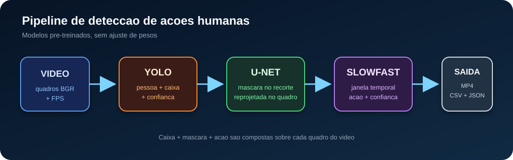
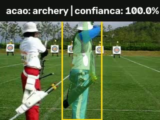
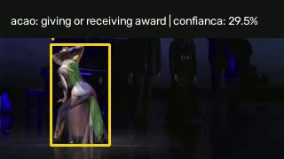

# CP5 - Detecção de ações com YOLO, U-Net e SlowFast



Aplicação de **Applied Computer Vision 2026**: lê vídeos curtos e integra três modelos já treinados, sem treinamento adicional. O resultado mostra caixa de pessoa, máscara segmentada, ação e confiança. A inferência é **offline**: a ação de uma janela é projetada sobre os quadros dessa mesma janela, usando seu contexto temporal completo.

## Arquivos da entrega

- [Relatório revisado em PDF — 3 páginas](docs/relatorio_cp5.pdf)
- [Demonstração com os dois vídeos e as três saídas sobrepostas](docs/demo_cp5.mp4)
- [Vídeo 1 completo anotado: arco e flecha](docs/results/video_1_archery_anotado.mp4)
- [Vídeo 2 completo anotado: palco / flamenco](docs/results/video_2_theatre_anotado.mp4)
- [Resultados por quadro e janela, execuções isoladas e comparação opcional](docs/results/)
- [Protocolo e interpretação dos experimentos](docs/PROTOCOLO_EXPERIMENTOS.md)

| Arco e flecha — 5 s | Palco — 5 s |
|---|---|
|  |  |

## O que foi executado

Os dois trechos têm **10 s a 8 FPS, 80 quadros cada**. Foram executados os três modelos isoladamente, o pipeline integrado e a comparação SlowFast quadro inteiro × recorte da pessoa.

| Medida observada | Arco e flecha | Palco |
|---|---:|---:|
| Quadros com detecção de pessoa | 80/80 | 78/80 |
| Quadros com máscara integrada não vazia | 80/80 | 33/80 |
| Quadros com máscara U-Net isolada não vazia | 80/80 | 79/80 |
| Janelas SlowFast | 4 | 4 |
| Momentos comparados no relatório | 0 s, 5 s, 9,88 s | 0 s, 5 s, 9,88 s |

Presença de detecção/máscara não mede acurácia. No palco, as classes foram `tango dancing`, `tango dancing`, `giving or receiving award` e `tango dancing`, com 32,2%, 55,3%, 29,5% e 69,6%. A dança observada é flamenco: tango aproxima o gênero, e a previsão de premiação é um erro. Essas limitações foram preservadas e explicadas.

## Matriz de requisitos do CP5

| Requisito | Implementação / evidência |
|---|---|
| YOLO para pessoa e bounding box | `YoloPersonDetector`, filtro COCO `person` |
| U-Net pré-treinada | **U-Net com EfficientNet-B0**, estado completo de encoder e decoder |
| Recorte da pessoa e projeção da máscara | recortes de caixas expandidas e `project_mask` |
| SlowFast em janelas sucessivas | 32 quadros, passo 16, α=4, última janela cobrindo o último quadro |
| Ação e confiança por janela | MP4, CSV por quadro e JSON com intervalos e top-3 |
| Modelos executados isoladamente | seis MP4s e tabelas em `docs/results/isolados/` |
| Dois vídeos e três momentos de cada | trechos de entrada e seis imagens versionados |
| Caixa, contorno e ação comparados | tabela e inspeção visual no PDF |
| Início/término e variação de confiança | fases do arco e flecha e todas as janelas discutidas no PDF |
| Pelo menos dois erros explicados | associação/segmentação no palco e classe incompatível |
| Relatório em PDF, no máximo três páginas | `docs/relatorio_cp5.pdf`, conferido automaticamente |
| Extensão opcional | quadro inteiro × recorte nas oito janelas |
| Até cinco integrantes e parecer técnico | integrantes, responsabilidades e textos de parecer no PDF |
| Sem treinamento adicional | somente inferência; pesos completos restaurados e U-Net em `eval()` |

A U-Net padrão usa um checkpoint público independente do material do Teams. O arquivo exato da aula não foi fornecido e não foi comparado. Se o professor exigir especificamente esse checkpoint, há um backend TorchScript para integrá-lo; a documentação não apresenta o modelo público como sendo o do Teams.

## Integrantes

| Nome | RM | Responsabilidade |
|---|---:|---|
| Guilherme Santos | 551168 | integração, testes e documentação |
| Enricco | 551717 | YOLO e leitura dos vídeos |
| Gabriel | 99227 | U-Net e projeção da máscara |
| Danilo | 99465 | SlowFast e janelas temporais |
| Laura | 98747 | experimentos, análise e apresentação |

Os textos de parecer estão organizados por área. Todos os integrantes devem revisá-los e participar da análise antes de enviar a entrega.

## Instalação

Ambiente usado na reprodução: **Python 3.12, CPU, FFmpeg e Git**. Recomenda-se pelo menos 8 GB de RAM. Instale FFmpeg e mantenha o executável no `PATH` para montar a demonstração e preparar os trechos.

```bash
git clone https://github.com/GuilhermeSSantos2004/Slow-Fast.git
cd Slow-Fast
python -m venv .venv
```

Ative o ambiente no Windows:

```powershell
.venv\Scripts\activate
```

Ou no Linux/macOS:

```bash
source .venv/bin/activate
```

Para o ambiente de CPU usado nos resultados:

```bash
python -m pip install --upgrade pip
python -m pip install -r requirements-cpu.txt
```

Para uma instalação com PyTorch já configurado para sua GPU, use `requirements-dev.txt`. O YAML aceita `device: cpu`, `cuda`, `mps` ou `auto`. CPU e GPU podem produzir pequenas diferenças numéricas.

Na primeira inferência, são baixados os pesos do YOLO, da U-Net e do SlowFast. A U-Net usa uma revisão fixa, verifica SHA-256 e carrega o estado completo com `strict=True` e `weights_only=True`. Não se trata de um decoder aleatório sobre um encoder ImageNet.

## Reproduzir a entrega inteira

Os dois trechos de entrada já estão em `assets/videos/`. Execute:

```bash
python scripts/reproduce_cp5.py
```

O comando executa os modelos, produz os resultados integrados e isolados, compara quadro/recorte, extrai seis evidências, gera o relatório e monta o vídeo demonstrativo. Os arquivos de referência em `docs/` são substituídos pelos resultados da nova execução.

Para baixar novamente os vídeos públicos originais, conferir seus checksums e recriar os trechos com FFmpeg:

```bash
python scripts/reproduce_cp5.py --download-sources
```

O manifesto [reproducao.json](docs/results/reproducao.json) registra fontes, recortes, hashes, versões e comandos. As observações visuais estão em [avaliacao_manual.json](docs/results/avaliacao_manual.json); se mudar os vídeos ou os modelos, reveja essas observações antes de gerar outro relatório.

## Executar seus próprios vídeos

```bash
python -m action_vision seu_video_1.mp4 seu_video_2.mp4 --config configs/default.yaml --output outputs
```

Cada vídeo deve conter ao menos 32 quadros. São gerados `nome_anotado.mp4`, `nome_frames.csv` e `nome_janelas.json`. O CSV inclui coordenadas da caixa, candidatos, área da máscara e a janela responsável pela ação exibida.

```bash
python -m action_vision seu_video.mp4 --person-crop --output outputs/recorte
python scripts/run_individual.py seu_video.mp4 --output outputs/isolados
```

A execução isolada da U-Net recebe o quadro inteiro, sem usar YOLO. Na comparação opcional, as caixas são lidas do CSV integrado, quando disponível na pasta pai, para comparar as mesmas pessoas; caso contrário, usam-se caixas do YOLO isolado. A origem fica registrada no JSON.

### Checkpoint U-Net da disciplina

Exporte o modelo da aula como TorchScript e ajuste a configuração:

```yaml
unet:
  backend: torchscript
  checkpoint: models/unet_teams.torchscript.pt
  input_size: 320
  threshold: 0.50
  box_margin: 0.10
```

O adaptador atual espera RGB `N × 3 × H × W`, valores em `[0,1]` e logits binários de máscara. Ajuste o tamanho e o pré/pós-processamento se o modelo do Teams tiver outro contrato; não presuma equivalência apenas pelo nome U-Net. O backend histórico U²-Net é opcional (`pip install -e '.[u2net]'`) e não é o padrão da entrega revisada.

## Verificações

```bash
python -m pytest -q
python -m ruff check src tests scripts
python scripts/check_delivery.py
```

Os 12 testes incluem leitura/escrita real de MP4 com adaptadores simulados, cobertura da cauda para 33 e 100 quadros, ação desde o primeiro quadro, reprojeção de máscara, continuidade espacial e seleção de pessoa segmentável. Esses testes não substituem a execução com redes reais, registrada nos arquivos de resultados. O CI também confere os vídeos, seis evidências, hashes, janelas e as três páginas do PDF.

## Limitações observadas

- Uma única pessoa principal é visualizada. Continuidade por IoU e prioridade de máscara não vazia não garantem identidade em cenas com várias pessoas.
- A máscara pode incluir fundo/objetos ou perder partes do corpo. Um recorte muda escala e proporções em relação ao quadro inteiro.
- As janelas se sobrepõem. Uma mudança de classe pode ocorrer sem mudança real de ação; confiança alta também pode acompanhar erro.
- No arco e flecha, a classe permanece estável entre preparação, mira e recuperação. No trecho de flamenco, não foi observado um início/término completo da dança; o relatório não atribui causalidade à variação de confiança.
- O modo padrão preserva contexto do quadro antes do recorte central padrão do SlowFast. O modo de pessoa usa a união das caixas e pode remover objetos importantes ou incluir outra pessoa.

## Fontes e licença

- [YOLO — Ultralytics](https://github.com/ultralytics/ultralytics)
- [Checkpoint completo U-Net — Aman Gupta, revisão fixa](https://github.com/amangupta143/PyTorch-Image-Segmentation/tree/d5f9ab4afd5e0f9aedaa7c1565d506e8e650f916); [licença MIT preservada](docs/licenses/unet_checkpoint_MIT.txt)
- [Arquitetura U-Net — Segmentation Models PyTorch](https://github.com/qubvel-org/segmentation_models.pytorch)
- [SlowFast / PyTorchVideo](https://github.com/facebookresearch/pytorchvideo)
- [Fonte de arco e flecha](https://dl.fbaipublicfiles.com/pytorchvideo/projects/archery.mp4)
- [Fonte do palco](https://dl.fbaipublicfiles.com/pytorchvideo/projects/theatre.webm)

Os trechos públicos são utilizados para o experimento acadêmico, com atribuição. Cada modelo, biblioteca e vídeo conserva seus próprios termos de uso.

## Envio no Teams

O enunciado solicita código executável, vídeo demonstrativo e PDF de até três páginas. Envie o código deste repositório, `docs/demo_cp5.mp4` e `docs/relatorio_cp5.pdf`. O envio no Teams e a confirmação do professor sobre o modelo da aula são ações externas ao repositório. O prazo indicado no PDF original é 06/10/2026 às 23h59.
